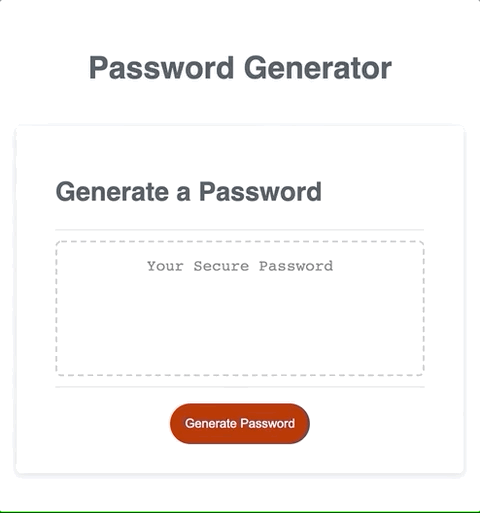
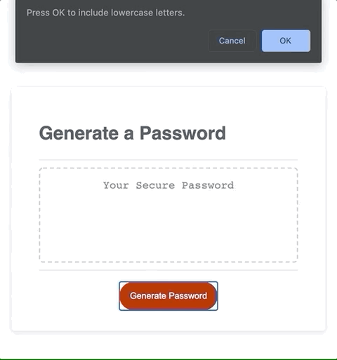
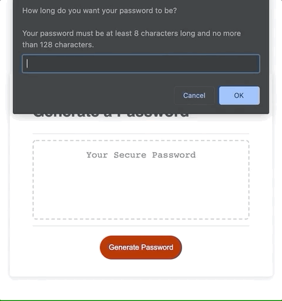
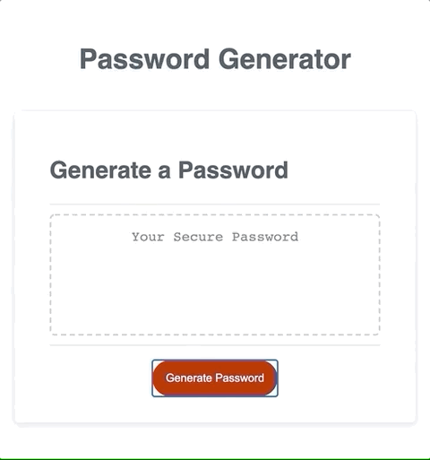

# 03 JavaScript: Password Generator

Built with HTML, CSS, and JavaScript.

URL of the deployed application: https://a-li-sa.github.io/password-generator/

URL of the GitHub repository: https://github.com/a-li-sa/password-generator

## Table of Contents 

* [Description](#description)
* [View](#view)
* [Usage](#usage)
* [Project Status](#project-status)
* [Built With](#built-with)
* [Credits](#credits)
* [License](#license)

## Description

I created an application that generates a random password based on user-selected criteria. This app will run in the browser and feature dynamically updated HTML and CSS powered by my JavaScript code. It will also feature a clean and polished user interface and be responsive, ensuring that it adapts to multiple screen sizes.

For any user that has access to sensitive data, this application will randomly generate a password that will meet certain criteria (i.e. containing lowercase characters, uppercase characters, numbers, and/or special characters), thus creating a strong password that provides great security.

### Acceptance Criteria 
GIVEN the user needs a new, secure password: 
- [x] WHEN I click the button to generate a password THEN I am presented with a series of prompts for password criteria
- [x] WHEN prompted for password criteria THEN I select which criteria to include in the password
- [x] WHEN prompted for the length of the password THEN I choose a length of at least 8 characters and no more than 128 characters
- [x] WHEN prompted for character types to include in the password THEN I choose lowercase, uppercase, numeric, and/or special characters
- [x] WHEN I answer each prompt THEN my input should be validated and at least one character type should be selected
- [x] WHEN all prompts are answered THEN a password is generated that matches the selected criteria
- [x] WHEN the password is generated THEN the password is either displayed in an alert or written to the page

## View

To view the website, you can click [here](https://a-li-sa.github.io/password-generator/).

## Usage

Click the button, answer the pop-ups on the screen, and then a password will be written to the page. 

On the left, an 8-character password "jY4?ZW<+" was generated, which contains at least one lowercase, one uppercase, one numeric, and one special character. If the user clicks "Cancel" for every character type, the user will be alerted to select at least one character type, and a password will not be generated. 

  
  

If nothing is typed or the number is outside the range, the user will be alerted, and the queued pop-ups will not run.

   
    

## Built With

* [HTML](https://html.spec.whatwg.org/) - Markup language used to define the structure of webpage.
* [CSS](https://www.w3.org/Style/CSS/) - Style sheet language used to add styling to markup languages like HTML. 
* [JavaScript](https://developer.mozilla.org/en-US/docs/Web/JavaScript) - Programming language that creates dynamic website content. In this application, JavaScript was used to generate the random password on the page. 

## Credits

The HTML, CSS, and starting JavaScript were provided by 2019 Trilogy Education Services, a 2U, Inc. brand. All Rights Reserved.

## License 

MIT License Copyright (c) 2020 Alisa Poon